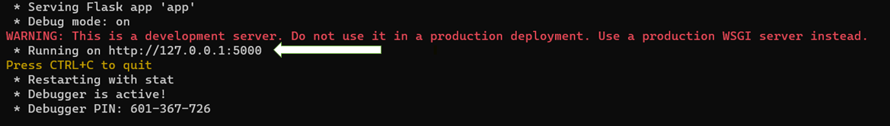
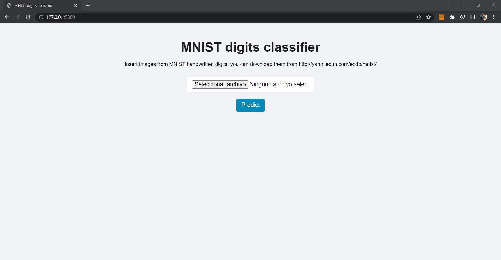

# Unsupervised Learning Workshop1

Here we are going to explore how some unsupervised learning methods have been built and also to implement them!

In addition, we are going to create an app (HTTP server) that receives records and will return the class of the image.

## Steps to replicate the repository:

```sh
git clone <ssh code>
pip install pipenv
pipenv shell
pipenv install
```
Note that you don't need a requirements.txt because we have a Pipfile and pipenv install command automatically install dependencies if
exists a Pipfile in the directory

## Components of repository

#### **workshop_development.ipynb**

Here you can find basics of linear algebra, images handling, singular value decomposition on images, PCA and t-SNE implementation

#### app:

Here is located the utils.py file where are written the classes built from scratch for unsupervised learning, saved models, flask app and the resources for this.

***Note: to launch the app, you need to access to this folder: app/, and then run the app as below:***

```sh
cd app
python app.py
```
Then it will be displayed and you have to copy the link of the server and then paste it in your browser:



And finally you will have the web service working like this!



You can upload MNIST images and you will receive a prediction of the class and its probability
